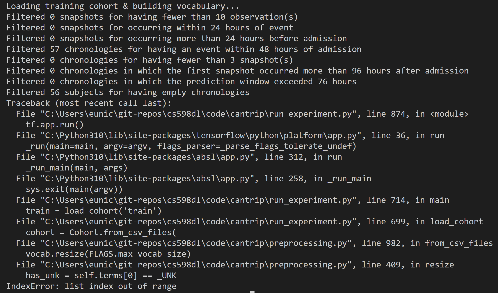

# CS598 DL4H Paper Reproducibility Project

This is the codebase for my Paper Reproducibility Project for my CS598 DL4H class. The objective of this project is reproduce a research paper of our choice. The paper I choose is [A customizable deep learning model for nosocomial risk prediction from critical care notes with indirect supervision](https://www.researchgate.net/publication/339351290_A_customizable_deep_learning_model_for_nosocomial_risk_prediction_from_critical_care_notes_with_indirect_supervision) by Travis Goodwin and Dina Demner-Fushman. 

Although I was not able to reproduce the results from the paper, I would still like to provide the code to the progress I have made, so that it can provide helpful information for anyone else who may also want to reproduce this paper. This repo will focus on any intermediate results that I got, along with any challenge and roadblock I ran into, hopefully providing useful insights to the reproducibility of this paper. 

This page will be broken down into the following sections:

1. [Overview](#Overview)
2. [Datasets](#Datasets)
3. [Installation](#Installation)
3. [Data Preprocessing](#data-preprocessing)
4. [Running the Model](#running-the-model)
5. [Results & Outputs](#results--outputs)
6. [Additional Note on Label Extraction](#results--outputs)
7. [References](#References)


## Overview


The implementation CANTRIP, which is the novel model proposed by the paper, is publicly available at [https://github.com/h4ste/cantrip](https://github.com/h4ste/cantrip). However, the existing implementation does not include data preprocessing steps. Therefore, this repo focuses on providing instructions on how to preprocess the data in the specific format that will be accepted by the CANTRIP model. 


## Datasets


The datasets used by the experiments are from MIMIC-III, which can be acquired from [PhysioNet](https://physionet.org/). First download the whole dataset, then extract the files in the zipped folders. 


## Installation

The project is built using Python version 3.10.1. To install the Python programming interface, see [https://www.python.org/](https://www.python.org/). 

First clone this repo and nagivated inside the directory
```
git clone https://github.com/eunicornbread/CS598DLFinalProject.git
cd CS598DLFinalProject
```

Then install all necessary packages required for the project
```
pip install -r requirements.txt
```

In addition, you need to download `MetaMap Lite` for this project. For more instructions, see [https://lhncbc.nlm.nih.gov/ii/tools/MetaMap/run-locally/MetaMapLite.html](https://lhncbc.nlm.nih.gov/ii/tools/MetaMap/run-locally/MetaMapLite.html). It is recommended to use MetaMapLite 3.6.2rc6 and 2020AA dataset, since other versions of `MetaMap` or `MetaMap Lite` may not work with `pymetamap`.


## Data Preprocessing

The files required by CANTRIP are `chronologies.csv`, `admittimes.csv`, and `labels.csv` for each of the `training`, `testing`, and `development` set. 

### Extracting chronologies from clinical notes

To extract chronologies from `NOTEEVENTS.csv`, run the following command
```
python extract_cui.py --metamap_lite_dir [metamap_lite_dir]
```

#### Required flags

```
--metamap_lite_dir: Directory path to metamap lite
```

#### Optional flags

```
--noteevents_file: File path to MIMIC-III dataset NOTEEVENTS.csv
  (default: './NOTEEVENTS.csv')
--output_dir: Path to directory to save all the output files
  (default: './output/')
--max_rows: Maximum number of rows to extract
  (default: 1000)
  (a positive integer)
```

#### Preparing processed data files

To prepare `chronologies`, `admittimes`, and `labels`, run the following command
```
python preprocessing.py
```

#### Optional flags

```
--data_dir: Path to directory that contains all the input data files
  (default: './data/')
--output_dir: Path to directory to save all the output files
  (default: './output/')
--chronology_dir: Path to directory that contains all the chronology files
  (default: './')
```

The repo also includes a IPython notebook if one wants to explore the data preprocessing steps in an interactive way. See `preprocessing.ipynb`. 

## Running the Model

To run the CANTRIP model, follow the instructions in the original repo (https://github.com/h4ste/cantrip). 


## Results & Outputs

Unfortunately, I was not able to get the CANTRIP model to run to completion, because all the input data I have used (around 2k rows from `NOTEEVENTS.csv`) are filtered out by the algorithm, resulting in the program crashing before it can split out any result. Here is an example output of running the model: 



The reason I used only a subset of the whole dataset is because of the limitation of computation power and time constraints. The problem is that `pymetamap` takes quite a while to process each clinical text, on average 3-5 seconds for each one. This significantly limits the size of the datasets I could use without having to wait for hours. Therefore, for future reproduction attempts, I strongly recommend parallelizing the file `extract_cui.py`. 

## Additional Note on Label Extraction

The labels extracted by `preprocessing.py` is for the general problem of mortality prediction. The original authors used code from [mimic-on-spark](https://github.com/h4ste/mimic-on-spark) to extract labels for specific hostpial acquired diseases: hospital acquired acute kidney injury (HAAKI), hospital acquired pressure injury (HAPI), and hospital acquired anemia (HAA). However, the `mimic-on-spark` codebase is currently outdated and broken, failing to produce the results it promises. This repository provides the following updated files to use in lieu of the corresponding files if anyone wants to tackle and debug `mimic-to-spark` to get the scripts to run till completion: 

- `build.gradle`
- `gradle-wrapper.properties`

Currently the program is able to compile, but it always fails towards the end after taking a couple hours and successfully loading most of `csv` files into the `Spark SQL` database. 

This repo also provides a `Dockerfile` to run `mimic-on-spark` program, since it can be tricky to install the distributed processing platform `Apache Spark` locally. 

To set up the environment for `mimic-on-spark` using `docker`, run the following commands:
```
# Build the docker image
docker build -t spark_docker . 

# Navigate inside mimic-on-spark and run the docker container
# In terminals other than cmd, may need to replace %cd% with the absolute path
docker run -it -v %cd%:/my_repo spark_docker bin/bash

# Inside the docker container
cd my_repo/
# Install gradle using this link: https://linuxize.com/post/how-to-install-gradle-on-ubuntu-18-04/

# Add the gradle wrapper
gradle wrapper

# Now we can compile the program with
./gradlew jar

# Make sure to put the csv files in a data folder and replace build.gradle and gradle-wreapper.properties
# file since the original ones are outdated and will prevent compiling 
```

## References


Goodwin, Travis & Demner-Fushman, Dina. (2020). A customizable deep learning model for nosocomial risk prediction from critical care notes with indirect supervision. Journal of the American Medical Informatics Association : JAMIA. 27. 10.1093/jamia/ocaa004. 

Johnson, A., Pollard, T., Shen, L. et al. MIMIC-III, a freely accessible critical care database. Sci Data 3, 160035 (2016). https://doi.org/10.1038/sdata.2016.35

pymetamap repo: https://github.com/AnthonyMRios/pymetamap

CANTRIP repo: https://github.com/h4ste/cantrip

mimic-on-spark repo: https://github.com/h4ste/mimic-on-spark